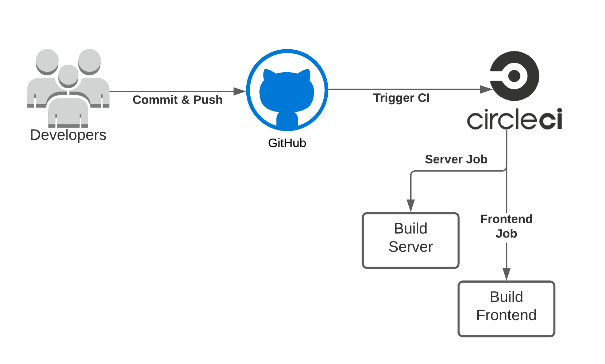

## Udagram Pipeline

### Dependencies
A list of project dependencies can be found [here](docs/dependencies.md).

### Installation

Provision the necessary AWS services needed for running the application:

1. In AWS, provision a publicly available RDS database running Postgres.
2. In AWS, provision a s3 bucket for hosting the uploaded files.
3. Export the ENV variables needed or use a package like [dotnev](https://www.npmjs.com/package/dotenv).
4. From the root of the repo, navigate udagram-api folder `cd starter/udagram-api` to install the node_modules `npm install`. 
5. After installation is done start the api in dev mode with `npm run dev`.
6. Without closing the terminal in step 1, navigate to the udagram-frontend `cd starter/udagram-frontend` to install the node_modules `npm install`. After installation is done start the api in dev mode with `npm run start`.

### Continuous Integration
#### GitHub
The developers commit and push their code to the GitHub repository which is linked to the CircleCI platform.
GitHub triggers the CircleCI platform when code is pushed to the repository.

#### CircleCI
CircleCI reads the `.circleci/config.yml` file which tells the service what has to be done. In the case of Udagram,
there are 2 jobs (frontend & server) to be run by CircleCI.
- **Frontend**: Runs the `build` script given in the `package.json` file. Then uses AWS CLI to upload assets to S3.
- **Server**: Runs the `build` script, exports all environment variables from CircleCI configuration to a `.env` file,
  then runs the `archive` script. Then uses AWS CLI to upload archive to S3 bucket used for uploading the server only.
